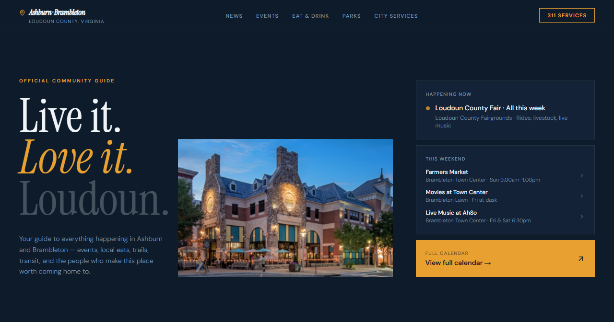

# Hometown Website

Community guide for Ashburn and Brambleton, Virginia — covering local events, dining, parks, transit, and city services.



## Running the project

```bash
npm install
npm run dev
```

Open [http://localhost:5173](http://localhost:5173) in your browser.

## Building for production

```bash
npm run build
```

## Tech stack

- React 18 + TypeScript
- Vite 6
- Tailwind CSS 4
- Lucide React (icons)

## Project structure

```
src/
├── data/           # Content — events, news, restaurants, parks, services
├── lib/            # Shared utilities (font style objects)
├── styles/         # Global CSS, theme tokens, fonts
└── app/
    ├── App.tsx     # Root shell — imports and orders all sections
    └── components/
        ├── common/     # Reusable utility components (ImageWithFallback)
        ├── sections/   # One file per page section
        └── shared/     # Design-system primitives (Eyebrow, Heading, Container)
```
